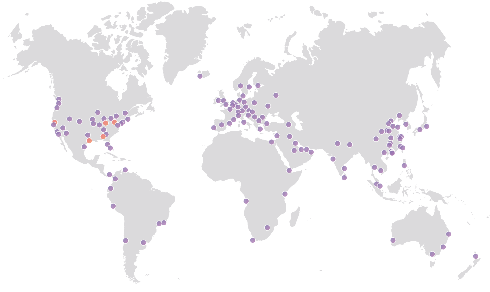

# Computing on the Edge
## Bringing **Serverless to you, fast!**

---

# Intro

* Kas Perch (they/their/them)
* @nodebotanist
* Developer Advocate @ Cloudflare
* Robotics addict/author

---

# First, a Quick Definition of 
## **'The Edge'**

---

# What this talk is about

* The ways we can make serverless **faster**
	* Faster **requests**
	* Faster **cold starts**
	* Faster **development**

---

# Faster Requests

* Reduce latency
* Reduce overhead
* Increase execution performance

---

# Reducing **Latency**

We leveraged our existing network to run your code as physically close to your users as possible

---

# Reducing Overhead Using **V8** and **Isolates.**

* **Isolates** are a class that creates a separate instance of V8 interpreter
	* Isolates do **NOT** share memory space with each other.
	* They are, essentially, **sandboxes** for code to run in safely.

---

# How Using V8 Decreases Overhead

---

# Increasing Execution **Performance**

* V8 offers great just-in-time optimization of JS
* Couple this with the compile-optimized performance of WebAssembly!

---

#[fit] The Best Way to Make Cold Starts Faster is to 
#[fit] **Get Rid of Them.**

---

# The V8 and Isolate Model and Cold Starts

* A Cold Start means spinning up a fresh isolate, not an entire container
* Internal measurement has our Cold Starts at **50ms**

---

## All of this is great, but most important is
#[fit] **Development Speed**

---

# Decreasing Development Speed

* Building on **Web Standards and Tech**
* Focusing on **Developer Experience**
* **Automate** common tasks and headaches

----

# What does this have to do with the V8 Engine?

---

# the V8 Engine and **Developer Experience**

* Raise your hand if you haven't written any JS, ever.
* Writing serverless functions in the same JS that developers are using all over the web.

---

# We did have to **fill in some gaps**

We ended up fully emulating the Service Worker API to represent Cloudflare Workers-- they run on a `fetch` event.

We decided to use Web standards to meet the needs of the platform in order to keep that usability.

---

# Focusing on Developer Experience with Wrangler

* CLI tool for developers
* Allows you to generate workers from scratch or from templates
* Lets you publish your workers from the CLI

---

# Magic Trick:
## Deploy a static app to serverless
# With 3 CLI commands

---

#[fit] Demo time!

---

# Why this developer experience matters

---

# The future of serverless lies in **doing things in different ways.**

Creating new serverless architectures from the ground up and allowing users to try different strategies is a key part of any movement's maturity.

---

# Want to learn more?

---

# Thanks for Listening!

* kas@cloudflare.com
* @nodebotanist
* github.com/nodebotanist/serverlessconf-nyc-2019

